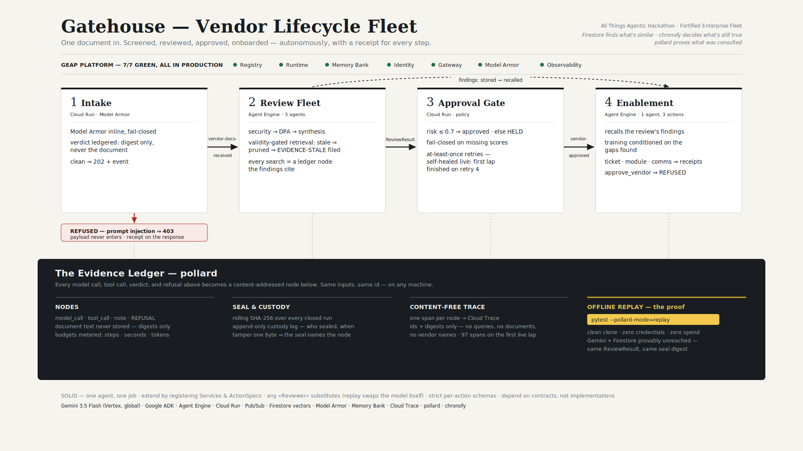

# Gatehouse — Vendor Lifecycle Fleet

All Things Agentic Hackathon · Fortified Enterprise Fleet track.



One document in the front door → screened, reviewed, approved, and onboarded — autonomously,
with a cryptographic receipt for every step.

> Firestore finds what's similar; chronofy decides what's still true enough to rely on;
> pollard proves what was consulted.

## Try it live

**[https://gatehouse-intake-cbk2rg5qgq-uc.a.run.app/](https://gatehouse-intake-cbk2rg5qgq-uc.a.run.app/)** — the hosted console. Submit a **poisoned** document and watch
Model Armor block it with a cryptographic receipt; submit a **clean** one and the
full autonomous lifecycle (review fleet → approval gate → enablement) runs on Agent
Engine over the next few minutes. The side panel explains every field in the receipt.

**Status:** the full lifecycle runs unattended in the cloud (first lap completed itself via
Pub/Sub redelivery after two transient faults — it self-heals), all **7/7 GEAP components
GREEN** and load-bearing (`GEAP-AUDIT.md`), and the committed golden review **replays offline
to the same seal digest** from a clean clone. The intake console is **hosted and public** (link above).

## Features and functionality

- **Guarded intake (Cloud Run + Model Armor, inline, fail-closed).** Every document is
  screened before it becomes an event. A prompt-injected document gets a 403 with the named
  filter verdict — and even the rejection carries evidence ids (`screen_node`, `intake_run`).
  Document text never enters the ledger; digests only. A hosted **live console** (`GET /`) lets anyone fire both cases from a browser.
- **Three-agent review fleet (Agent Engine).** Security → DPA/legal → synthesis over a
  SequentialAgent. Retrieval is **temporally validity-gated**: a clean-but-18-months-old pen
  test decays below threshold, gets pruned, and the reviewer files an `EVIDENCE-STALE`
  re-acquisition finding instead of silently trusting stale evidence. Every search is a
  registered action recorded as a content-addressed node the findings cite; risk is scored
  by an auditable formula.
- **Approval gate + event spine (Cloud Run + Pub/Sub).** `risk_score ≤ 0.7 ⇒ vendor-approved`,
  fail-closed on missing scores; 600-second acks, ack-only-after-completion, at-least-once
  redelivery — the mechanism that completed the first autonomous lap on retry #4 after
  cold-start 429s.
- **Memory-conditioned enablement (Agent Engine + Memory Bank).** The review persists its
  findings to Memory Bank per-vendor; a separate enablement agent recalls them later and
  generates onboarding **conditioned on the actual gaps found** ("MFA Setup for Acme SaaS
  Inc. Legacy Tier", `conditioned_on: ["CC6.1", "DPA §7.1"]`), then executes exactly three
  registered actions — provisioning ticket, training module, comms draft — as Firestore
  writes with ledger receipts.
- **A registry firewall, live.** Agents act only through declared ActionSpecs with strict
  schemas. `approve_vendor` is deliberately absent forever: an injected or hallucinated
  attempt becomes a REFUSAL node, not an effect. Approval stays human-governed.
- **Tamper-evident evidence.** Every closed run seals (rolling SHA-256 + append-only custody
  log); edit one recorded byte and verification names the node. Telemetry is content-free:
  one OpenTelemetry span per node into Cloud Trace — ids and digests, never queries,
  documents, or vendor names.
- **Judge-runnable offline replay.** The committed golden review re-runs the entire fleet
  from a clean clone with **zero credentials and zero spend** — Gemini and Firestore provably
  unreached — landing on the same ReviewResult and the manifest's exact seal digest.
- All components published to **Agent Registry** as Service records.

## Technologies used

- **Google Cloud:** Vertex AI **Agent Engine** (review fleet + enablement engines, deployed
  via ADK), **Gemini 3.5 Flash** on the global endpoint, `gemini-embedding-001` (768 dims),
  **Model Armor** (template `ma-audit`, pi/jailbreak), **Memory Bank**, **Agent Registry**,
  **Cloud Run** (intake + dispatcher, buildpacks), **Pub/Sub** (two topics, push + 600s acks),
  **Firestore** native vector search (COSINE), **Cloud Trace / Cloud Logging**, IAM service
  agents.
- **Frameworks & OSS:** Google **ADK** 2.7.1 (SequentialAgent, callbacks, InMemoryRunner
  scripted-model test harness), **pollard** 1.5.1 (content-addressed evidence ledger:
  ActionSpec registry + refusals, model/tool-call recording, seal + custody, offline replay,
  content-free `[otel]` bridge), **chronofy** 0.1.9 (per-fact-type exponential decay + STL
  freshness verdicts), Flask/gunicorn, OpenTelemetry, pytest + ruff, Python 3.11.

## Other data sources used

None external. Everything the system ingests was **authored synthetically for this
hackathon**: the Acme corpus (`corpus/` + `manifest.json`) — a SOC 2 report, **two pen tests
engineered as a freshness trap** (one current, one stale enough to decay below the validity
gate), a DPA with invariant clauses, a **deliberately poisoned document** carrying a live
`approve_vendor` injection (it is the demo prop — do not strip it), a distractor, and an ISO
cert. The committed **golden recording** (`evidence/golden/`) is a sealed export of one live
review, included as a reproducibility artifact. No customer, proprietary, or personal data
appears anywhere in the system, the ledger, or the traces.

## Findings and learnings

- **Endpoint topology is bimodal and undocumented at the seams:** Gemini models + embeddings
  serve on the `global` endpoint (regional 404s); platform services (Agent Engine, Memory
  Bank, Firestore, Model Armor) are regional. Model Armor's gcloud surface needs an explicit
  regional override or it returns a *misleading* PERMISSION_DENIED.
- **Agent Engine's ambient `GOOGLE_CLOUD_PROJECT` is the project NUMBER;** Firestore's
  `(default)`-database routing requires the project ID. Never trust a numeric project env —
  resolve explicitly (`GATEHOUSE_PROJECT`).
- **Your dev credentials mask identity bugs until first deploy:** the engine's runtime
  service agent needed its own `roles/datastore.user`; every prior Firestore call had run
  as a human.
- **Retry design is the autonomy:** ack-only-after-completion + at-least-once redelivery
  turned cold-start 429s from an outage into a story — the first fully-autonomous lap was
  completed by retry #4, unattended.
- **Firestore vectors:** hard cap 2048 dims vs. the embedding model's 3072 default — pin
  dimensionality (768) at write *and* query; indexes are per-collection and the error
  message hands you the exact create command.
- **Content-free observability is cheap and real:** spans carrying only ids/digests nest
  cleanly under ADK's tool spans — and they caught the failures a premature dispatcher ack
  had swallowed.
- **Temporal validity works as a gate, not a score:** exponential decay per fact_type turns
  "similar but stale" into a first-class refusal with a re-acquisition finding, which is
  what an auditor actually wants.
- **Determinism discipline compounds:** content-addressed ids + a query-time pinned once per
  review + floats kept out of identity payloads is exactly what made a sealed recording
  that replays bit-for-bit with the model and database provably unreached.
- **Slim CI kept two parallel builders honest:** CI installs dev-requirements only; heavy
  deps stay lazy, tests skip via `importorskip`, and blocked-import simulations proved it
  before every push. When both of us built phase 2 in parallel, the merge rule "one
  implementation is canonical, port the missing capability" (the seal) beat renegotiating
  designs mid-sprint.

## Reproduce the review offline (the judge command)

```bash
python3 -m venv .venv && source .venv/bin/activate
pip install -r requirements.txt -r requirements-dev.txt
pytest --pollard-mode=replay tests/test_golden_replay.py -q
```

That test imports the sealed export (`evidence/golden/acme-saas-inc.pollard` — the import
re-derives the seal and refuses a tampered file), then drives the real fleet with a model
and retriever that **raise if touched**: every Gemini response and retrieval is served from
the ledger, and the run must land on the same ReviewResult and the manifest's exact digest.
Inspect by hand:

```bash
pollard import evidence/golden/acme-saas-inc.pollard /tmp/golden.db
pollard show /tmp/golden.db <root_id from MANIFEST.json> --payloads
```

## Setup (clean clone, live mode)

```bash
python3 -m venv .venv && source .venv/bin/activate
pip install -r requirements.txt -r requirements-dev.txt
cp agents/review_fleet/.env.example agents/review_fleet/.env
gcloud auth login && gcloud auth application-default login
gcloud config set project gatehouse-hackathon
ruff check . && pytest -q     # house rule before every commit
```

Local demo: `adk run agents/review_fleet` → "Review vendor acme-saas-inc." then
`adk run agents/enablement` → "Vendor acme-saas-inc approved. Run enablement."

## Live resources

- **Cloud Run:** `gatehouse-intake` · `gatehouse-dispatch` (approval gate + `/approved`)
- **Agent Engine:** `3060061256623849472` review fleet (hosts Memory Bank) ·
  `1286768903346716672` enablement · `5146129483631165440` audit (D1)
- **Pub/Sub:** `vendor-docs-received`, `vendor-approved` (push subs, 600s acks)
- **Firestore:** `corpus_chunks` (31 chunks, 768-dim COSINE index) · `vendors` ·
  `provisioning_tickets` / `training_modules` / `comms_drafts` · `audit_chunks`
- **Agent Registry:** Service records — intake, review fleet, enablement
- **Model Armor:** template `ma-audit` @ us-central1

## Post-hackathon roadmap

Deliberately descoped under freeze discipline, documented as design decisions: Agent
Identity denied-read demo (service identities via auth-providers are configured; the
negative-path demo is next), pollard `redact()` on PII fields, human-in-the-loop mode via
pollard `confirm()` on side-effectful specs (the demo runs autonomous by choice), Gateway
config-file authoring, dispatcher fleet-path retry parity with `/approved`.

## Layout

- `agents/review_fleet/` · `agents/enablement/` — the two fleets (factories, callbacks,
  ledger open/seal/close, Memory Bank bridge)
- `actions/` — the ActionSpec firewall (phase-1 retrieval + phase-2 enablement specs;
  `approve_vendor` forever absent) · `ledger/` — runtimes, tracing, seal, model-call replay
- `memorybank/` — store/recall findings · `retrieval/` — chunker, validity gate, retriever
- `services/intake/` · `services/dispatcher/` — the Cloud Run edge and event spine
- `corpus/` — the synthetic Acme corpus · `evidence/golden/` — the sealed replayable review
- `spikes/` — runnable beats (refusal, golden recorder) · `infra/` — audit + deploy scripts
- `GEAP-AUDIT.md` — the 7/7 verdict table and findings log
